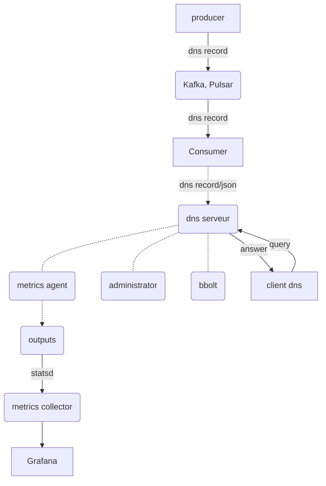

[](https://travis-ci.org/CleverCloud/stream-dns)

Stream-dns is a DNS server written in Go originally written in [Clever Cloud](https://www.clever-cloud.com/).

Stream-dns can listen for DNS requests coming in over UDP/TCP and use kafka as datastore and zone propagation.

Currently Stream-dns is able to:

* Serve zone data and resolve for none zone authority
* act as a primaries server (AXFR only)
* Automatically load zone from Kafka.
* Forward queries to some other (recursive) nameserver.
* Provide metrics with the `statsd` format
* Provide query and error logging
* Systemd integration (service)




## Compilation from Source

To compile `Stream-dns`, we assume you have a working Go setup. See various tutorials if you don’t have that already configured.

First, make sure your Golang version is 1.11+ or higher as [go mod](https://github.com/golang/go/wiki/Modules) support is needed. See here for go mod details. Then, check out the project and run the command:

`go install stream-dns`

This should create a stream-dns binary in your `GOBIN` or bin folder within your `GOPATH` folder.

NOTE: packages for mainstream Linux distribution should come soon.

## configuration

Stream-dns use environment variables for it's configuration.
The following environment variables can be set:

| Variable                   | Type           | Description                                                                                     |
|----------------------------|----------------|-------------------------------------------------------------------------------------------------|
| DNS_ADDRESS                | string         | Address for the DNS server e.g: ":8053"                                                         |
| DNS_TCP                    | bool           | Accept TCP DNS connection                                                                       |
| DNS_UDP                    | bool           | Accept UDP DNS connection                                                                       |
| DNS_RESOLVER_ADDRESS       | string         | Address use to resolve unsupported zone                                                         |
| DNS_ZONES                  | List of string | List of supported zones e.g: "clvrcld.net. services.clever-cloud.com." (separate by whitespace) |
| DNS_KAFKA_ADDRESS          | string         | Address of one kafka node e.g: "localhost:9092"                                                 |
| DNS_KAFKA_TOPIC            | string         | Kafka topic of the records                                                                      |
| DNS_METRICS_BUFFER_SIZE    | int            | Size of the metrics buffer in bytes                                                             |
| DNS_METRICS_FLUSH_INTERVAL | int            | Flushing interval of the metrics                                                                |
| DNS_PATHDB                 | string         | Path of the bbolt database e.g: "/tmp/my.db"                                                    |
| DNS_SENTRY_DSN             | string         | DSN to the sentry project e.g: "https://<key>:<secret>@sentry.io/<project>"                     |
| DNS_STATSD_ADDRESS         | string         | Address use to output the metrics in a statd format e.g: "127.0.0.1:8125"                       |
| DNS_STATSD_PREFIX          | string         | (optional) Add a prefix on statd field metric                                                   |
| DNS_DISALLOW_CNAME_ON_APEX | bool           | (optional) Disallow CNAME on a APEX domain                                                      |
| DNS_ADMIN_USERNAME         | bool           | (optional) username for HTTP administrator service                                              |
| DNS_ADMIN_PASSWORD         | bool           | (optional) password for HTTP administrator service                                              |
| DNS_ADMIN_ADDRESS          | bool           | (optional) Address for the HTTP administrator                                                   |
| DNS_ADMIN_JWTSECRET        | bool           | (optional) JWT secret for administrator credentials                                             |

## Run it

An important preliminary phase is to start a single Kafka node. You can do this easily by following the instructions in this quickstart tutorial: https://kafka.apache.org/quickstart (just the first two steps). You an use the tool script [seed.go](https://github.com/CleverCloud/stream-dns/blob/master/tools/seed/seed.go) provide in this repository to populate your Kafka topic with fake record.

After that, just start Stream-dns: `./stream-dns` by setting the configuration through environment variables (see §configuration for more information). Then just query on that port (53). The query should be catch for authoritary zone DNS or forwarded to another nameserver e.g: 9.9.9.9 and the response will be returned. Each query should also show up in the log which is printed on standard output.

You can query the `stream-dns` with the utilitary Linux tool [dig](https://linux.die.net/man/1/dig):

`dig @<ip address> -p <port> <domain>` (see dig man page for more information)

Example:

```bash
dig @127.0.0.1 -p 8053 my.domain.internal
dig @127.0.0.1 -p 8053 a example.com
```

NOTE:  You'll need to be root to start listening on port 53.

### Record in Kafka

The Kafka message key MUST follow the format: `<domain>.|<qtype>` and the payload:

```json
[
	{ "name": "domain", "type": "record type", "content": "<ip address and other infos like SOA>", "priority": 0 },
	...
]
```

You can use the utils script [seed.go](https://github.com/CleverCloud/stream-dns/blob/master/tools/seed/seed.go) to populate a Kafka topic with fake records:

```bash
TOPIC=test BROKER_ADDRESS="localhost:9092" $GOPATH/bin/seed
```

### Deployment

You can deploy this as a systemd service with the Unit file prodived: [data/stream-dns.service](https://github.com/CleverCloud/stream-dns/).

### Run with Docker

If you already have docker installed and prefer not to setup a Go environment, you could run Stream-dns easily in a Linux container:

```bash
docker build -t $USER/stream-dns .
docker run --rm -p 8053:53 stream-dns
```

or with docker-compose to have stream-dns with a kafka and his zookeeper:

```bash
docker-compose up
```

## Administration tool

The HTTP administrator server currently, allow you to search records with a pattern which can be usefull to check the current state of the database.

For known, the HTTP administrator server is exposed through an optional JWT authentication system. To setup it, you just have to set the environment variables:

* DNS_ADMIN_USERNAME
* DNS_ADMIN_PASSWORD
* DNS_ADMIN_ADDRESS
* DNS_ADMIN_JWTSECRET

### sign in

`curl -X -v http://<address>/signin -d '{"username":"<your username>","password":"<your password>"}'`

### Search records following a pattern

`curl --cookie token=<JWT token> "http://<address>/search?pattern=<your pattern>`