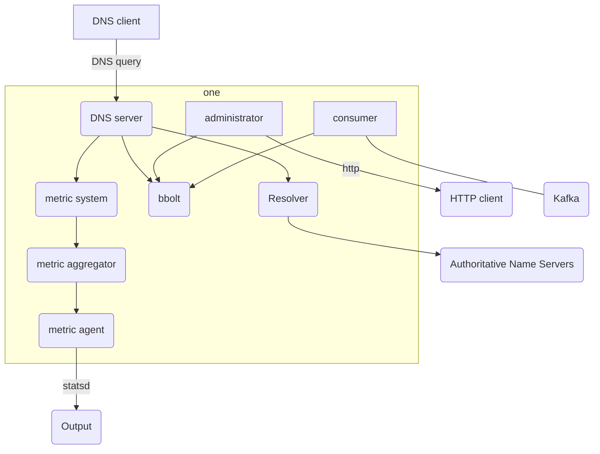
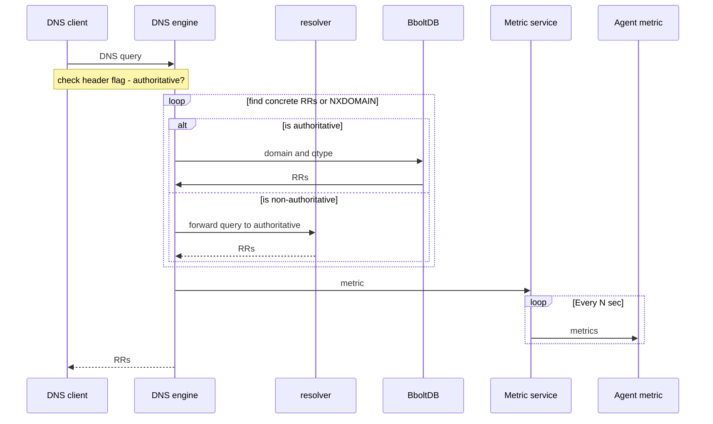
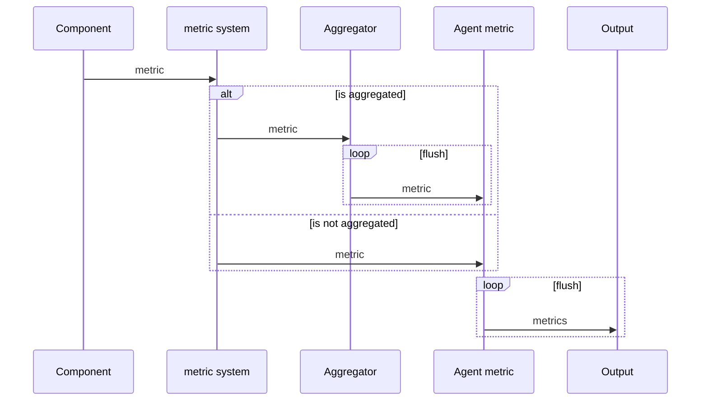

**Last modification:** 13/01/2020 by Coltellacci Alessio <alessio.coltellacci@clever-cloud.com>

# Architecture 

*NOTE: This part is mostly for people who want to understand how stream-DNS work internally.*

## Overview

This mermaid diagram give you an overview of major components that compose stream-DNS:

| Component           | Description                                                  |
| ------------------- | ------------------------------------------------------------ |
| DNS server          | Engine that implements the specification of authority name servers to answer DNS queries. This follows the specifications describe in the [1034](https://tools.ietf.org/html/rfc1034) and [1035](https://tools.ietf.org/html/rfc1035). Return DNS records for a given DNS queries for authoritative zone and leans on the Resolver when DNS queries hit a non-authoritative zone. |
| Resolver            | Wrappers around the DNS resolver: [dnsr](https://github.com/domainr/dnsr), an iterative DNS resolver for Golang. The resolver caches responses for queries, and liberally returns DNS records for a given name, not waiting for slow or broken name servers. |
| Consumer            | Event source consumers for Kafka or Pulsar. It collects records (in `JSON` format) from the events source, do some check and transform it in `dns.RR` structure from the Miek Gieben’s DNS library to finally save it in `bbolt`. |
| Bbolt               | An embedded key/value RAM database with backup persistence on the disk. It is used as a DNS cache for the DNS server. |
| Administrator (WIP) | Administration agent is an embedded light `HTTP` server, that help operational to check the current state of a stream-DNS instance. The `HTTP` protocol is used to communicate with it. It supports `JWT` token authentication for security. |
| Metric Agent        | Agent which collect metrics send by other Stream-DNS components through Go channels, in order to send them, in specific format as `statsd`, to external storage and analytics engines like Warp10, Telegraf, etc. |

### DNS protocol implementation

Stream-DNS use the library: [github.com/miekg/dns](https://github.com/miekg/dns), which provide to us a DNS server skeleton. They parse incoming DNS queries and write answers for us. They also provide data structure for RRs, A, AAAA, etc. and as this library support most of DNS RFC, it can allow us to support specific DNS features like DNSSEC, TSIG, etc.

The code in the DNS engine mostly uses data structure from this library. So please, don't make a wrapper or your own data structure and check in the library if they  have not already done it yet.

We have chosen this library because most of the DNS project in the Golang ecosystem rely on this library. So this library was a safe choice.

### Goroutines and shared nothing architecture

Each independent part of Stream-DNS are put in a goroutine, a lightweight thread managed by the Go runtime. Each part communicates through the channel, which allows goroutines to synchronize without explicit locks or condition variables.

## Event Sourcing

### overview

The Event Sourcing pattern defines an approach to handling operations on data that's driven by a sequence of events, each of which is recorded in an append-only store. Application code will sends a series of events that imperatively describe each action that has occurred on the data to the event store, where they're persisted. Each event represents a set of changes to the data.

The events are persisted in an event store that acts as the system of record (the authoritative data source) about the current state of the data. The event store typically publishes these events so that consumers can be notified and can handle them if needed. Consumers could, for example, initiate tasks that apply the operations in the events to other systems, or perform any other associated action that's required to complete the operation. Notice that the application code that generates the events is decoupled from the systems that subscribe to the events.

Typical uses of the events published by the event store are to maintain materialized views of entities as actions in the application change them, and for integration with external systems.

**The figure shows an overview of the pattern:**

](https://miro.medium.com/max/650/1*oSOTEY5OOcyjFvJ4utjiYw.jpeg)

Event Sourcing Diagram. Picture from: [https://www.confluent.io](https://www.confluent.io/)

### How Stream-DNS use Event Sourcing pattern

Your services will produce a series of events that describe each modification that has occurred on records to the event store, where they're persisted. Each event represents a set of changes to a DNS record. This event store can be an Apache Kafka or Apache Pulsar cluster. So your event source will maintain a materialized view of your DNS zones.

Stream-DNS will create a consumer for your event store, which will be notified when it can handle DNS records. By replaying all the record from the beginning, it'll recreate the last state of your DNS zone and maintain this materialized views in `bbolt`.

All information related to DNS zone is therefore stored in your event source. If you want to monitor your zone, you can develop or use tools provide by your event source (ex: Kafka monitor). You don't have anymore to use DNS tools to monitor your zone like: `AXFR` (get the content of a entire zone).

## Answering Queries

### Algorithm

The actual algorithm used by the name server followq the specification: [RFC1034](https://tools.ietf.org/html/rfc1034#section-4.3.2). 

   1. Set or clear the value of recursion available in the response
      depending on whether the name server is willing to provide
      recursive service.  If recursive service is available and
      requested via the RD bit in the query, go to step 4,
      otherwise step 2. This job is mostly done by our DNS library.

   2. Look if the domain in the query is for an authoritative zone or not. If yes, go to step 3, otherwise go to step 4.
      
   3. Start matching down, RR by RR, in the authoritative zone.  The
      matching process can terminate several ways:
-  If the whole of `QNAME` is matched, we have found the node. If the data at the node is a `CNAME`, and `QTYPE` doesn't match `CNAME`, copy the `CNAME` RR into the answer section of the response, change `QNAME` to the canonical name in the `CNAME RR`, and go back to step 2. Otherwise, copy all `RRs` which match `QTYPE` and all the intermediate `CNAME` into the answer section and go to step 4.
   
- If a match took us out of the authoritative data, we have a referral.  So forward the query to the resolver and wait for his reponse. The resolver will send back a pair of NS and `RRs` or an empty response.  Copy the NS `RRs` for the subzone into the authority section of the reply ,and copy all the `RRs` which match `QTYPE` in the answer and go to step 2 (maybe we'll have to continue now in our authoritative zone if the referral brings us back in our authoritative zones). 
  
- If at some label, a match is impossible (_i.e._, the corresponding label does not exist), look to see if the * RR exists.  If the `"*"` label does not exist, check whether the name we are looking for is the original `QNAME` in the query or a name we have followed due to a `CNAME`.  If the name is original, set an authoritative name error in the response and exit.  Otherwise just exit.If the  label does exist, match `RRs` at that node against `QTYPE`.  If any match, copy them into the answer section, but set the owner of the RR to be `QNAME`, and not the node with the `"*"` domain.  Go to step 4.
      
   4.  Using local data only, attempt to add other `RRs` which may be useful to the additional section of the query (like `SOA` in authoritative section).  Exit.

This sequence diagram illustrates this algorithm above and add the communication between the DNS engine and the metric service.

### Resolver

To avoid wasting energy or resources in _reinventing the wheel_, Stream-dns includes the project [dnsr](https://github.com/domainr/dnsr): an iterative DNS resolver for Go. Stream-DNS engine and dns don't share a RRs cache. They are completely separated to avoid [DNS cache poisoning](https://en.wikipedia.org/wiki/DNS_spoofing):  a form of computer security  hacker in which corrupt [Domain Name System](https://en.wikipedia.org/wiki/Domain_Name_System) data is introduced into the [DNS resolver](https://en.wikipedia.org/wiki/DNS_resolver)'s cache, causing the name server to return an incorrect result record, e.g. an IP address. This results in traffic being diverted (Man in the middle attack) to the attacker's computer (or any other computer).

## Metric service

The best way to ensure proper Stream-DNS performance and operation is by monitoring its key metrics in three broad areas:

* **DNS engine metrics** such as client connections and requests.
* **Consumer metrics** such as the number of record got from your event source (ex: Kafka).
* **Resolver metrics** such as the  number of queries to non-authoritative zone.

Correlating this metric can give you a more comprehensive view of your infrastructure and helps you quickly identify potential hotspots. You have to remember that DNS is a key component in a network communication as is the first thing to do to know where a node is located.

At each flush interval (which is configurable), the `Metric Agent` will send to each `output` defined, the metrics produced by each internal components. An output is the name used to qualify a client of an external storage and analytics engines.

### How it work

The figure shows an overview of the process, follow by Stream-DNS, to send a metric to  external storage and analytics engines in infrastructure:

**NOTES:**

* To avoid a performance loss due to the metric system, Stream-DNS relies on the channel and Goroutine to manage metrics in a concurrent way. 

* Stream-DNS is also being able to aggregate by his own the metric in order to reduce the network bandwidth.

### Supported ouput

For now, Stream-DNS only support [statsd](https://github.com/statsd/statsd) metric format, so it can only send metric to [statsd](https://github.com/statsd/statsd). service. Pull Request are welcome if you want to add your a output, or you can open an issue [here](https://github.com/CleverCloud/stream-dns/issues) for asking the support of a new output.

## Zone maintenance and transfers 

Part of the job of a zone administrator is to maintain the zones at all of the name servers which are authoritative for the zone.  When the inevitable changes are made, they must be distributed to all of the name servers. Because of Stream-DNS rely on the event sourcing architecture with Kafka (and soon Pulsar) as an event source, an administrator just has to produce a new event record to modify the zones. Stream-DNS nodes are in continuous listening of the event sources, they'll automatically, and as soon as possible, detect change in the zone. Due to event sourcing architecture with Kafka, we don't support [DNS Zone Transfer Protocol (AXFR)](https://tools.ietf.org/html/rfc5936).