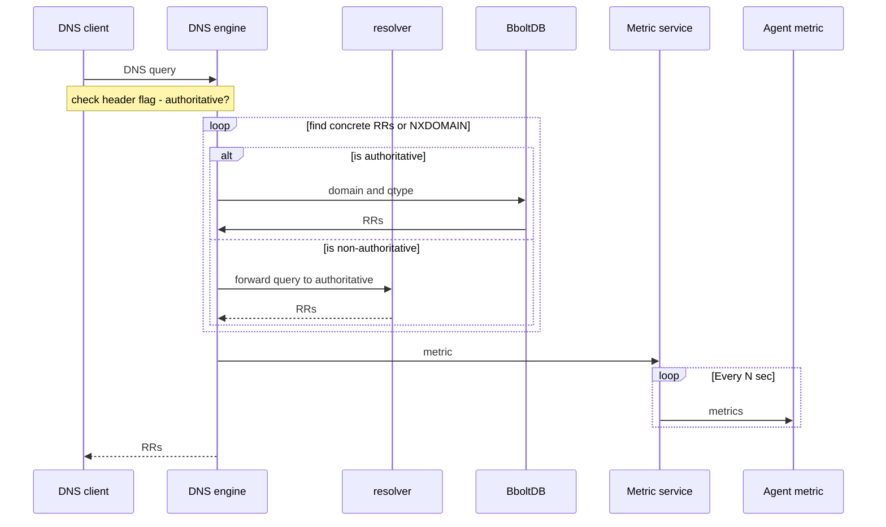

# Architecture 

This part is mostly for people who want to understand how stream-dns work internaly.

## DNS protocol implementation

Stream-DNS use the library: [github.com/miekg/dns](https://github.com/miekg/dns), which provide to us a DNS server skeleton. They parse incoming DNS queries and write answer for us. They also provide data structure for RRs, A, AAAA, etc. and as this library support most of DNS RFC, it can allow us to support specific DNS features like: DNSSEC, TSIG, etc.
The code in the DNS engine mostly use data structure from this library. So please, don't make a wrapper or your own data structure and check in the library if they  have not already done it yet.

We have choose this library because most of the DNS project in the Golang ecosystem rely on this library. So this library was a safety choice.

## Goroutines and shared nothing architecture

Each independent part of Stream-DNS are put in a goroutine, a lightweight thread managed by the Go runtime. Each part communicate through channel, which allows goroutines to synchronize without explicit locks or condition variables.

## Event Sourcing

### overview

TODO

### How consumer work

TODO

## Answering Queries

### Algorithm

The actual algorithm used by the name server follow the specification: [RFC1034](https://tools.ietf.org/html/rfc1034#section-4.3.2). 

   1. Set or clear the value of recursion available in the response
      depending on whether the name server is willing to provide
      recursive service.  If recursive service is available and
      requested via the RD bit in the query, go to step 4,
      otherwise step 2. This job is mostly done by our DNS library.

   2. Look if the domain in the query is for an authoritative zone or not. If yes, go to step 3, otherwise go to step 4.
      
   3. Start matching down, RR by RR, in the authoritative zone.  The
      matching process can terminate several ways:

      -  If the whole of QNAME is matched, we have found the node. If the data at the node is a CNAME, and QTYPE doesn't match CNAME, copy the CNAME RR into the answer section of the response, change QNAME to the canonical name in the CNAME RR, and go back to step 2. Otherwise, copy all RRs which match QTYPE and all the intermediate CNAME into the answer section and go to step 4.

      - If a match would take us out of the authoritative data, we have a referral.  So forward the query to the resolver and wait for his reponse. The resolver will send back a pair of NS and RRs or an empty response.  Copy the NS RRs for the subzone into the authority section of the reply ,and copy all the RRs which match QTYPE in the answer and go to step 2 (maybe we'll have to continue now in our authoritative zone if the referral brings us back in our authoritative zones). 

      - If at some label, a match is impossible (_i.e._, the corresponding label does not exist), look to see if a the * RR exists.  If the "*" label does not exist, check whether the name we are looking for is the original QNAME in the query or a name we have followed due to a CNAME.  If the name is original, set an authoritative name error in the response and exit.  Otherwise just exit.If the  label does exist, match RRs at that node against QTYPE.  If any match, copy them into the answer section, but set the owner of the RR to be QNAME, and not the node with the "*" domain.  Go to step 4.

   4.  Using local data only, attempt to add other RRs which may be useful to the additional section of the query (like SOA in authoritative section).  Exit.
      
      
This sequence diagram illustrate this algorithm above and add the communication between the DNS engine and the metric service.

### Resolver

To avoid wasting energy or resources in _reinventing the wheel_, Stream-dns include the project [dnsr](https://github.com/domainr/dnsr): an iterative DNS resolver for Go. Stream-DNS engine and dns doesn't share a RRs cache. They are completely separated to avoid [DNS cache poisoning](https://en.wikipedia.org/wiki/DNS_spoofing):  a form of computer security  hacker in which corrupt [Domain Name System](https://en.wikipedia.org/wiki/Domain_Name_System) data is introduced into the [DNS resolver](https://en.wikipedia.org/wiki/DNS_resolver)'s cache, causing the name server to return an incorrect result record, e.g. an IP address. This results in traffic being diverted (Man in the middle attack) to the attacker's computer (or any other computer).

## Metric service

TODO

## Zone maintenance and transfers 

Part of the job of a zone administrator is to maintain the zones at all of the name servers which are authoritative for the zone.  When the inevitable changes are made, they must be distributed to all of the name servers. Because of Stream-DNS rely on the event sourcing architecture with Kafka (and soon Pulsar) as en event source, an administrator has just to produce new event record to modify the zones. Stream-DNS nodes are in continuous listening of the event sources, they'll automatically, and as soon as possible, detect change in the zone. Due to event sourcing architecture with Kafka, we doesn't support [DNS Zone Transfer Protocol (AXFR)](https://tools.ietf.org/html/rfc5936).

